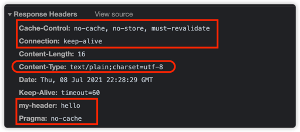
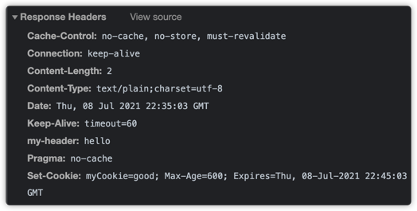
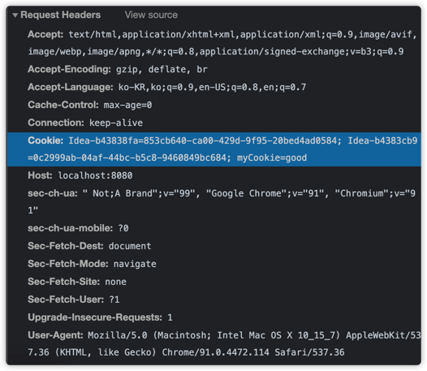
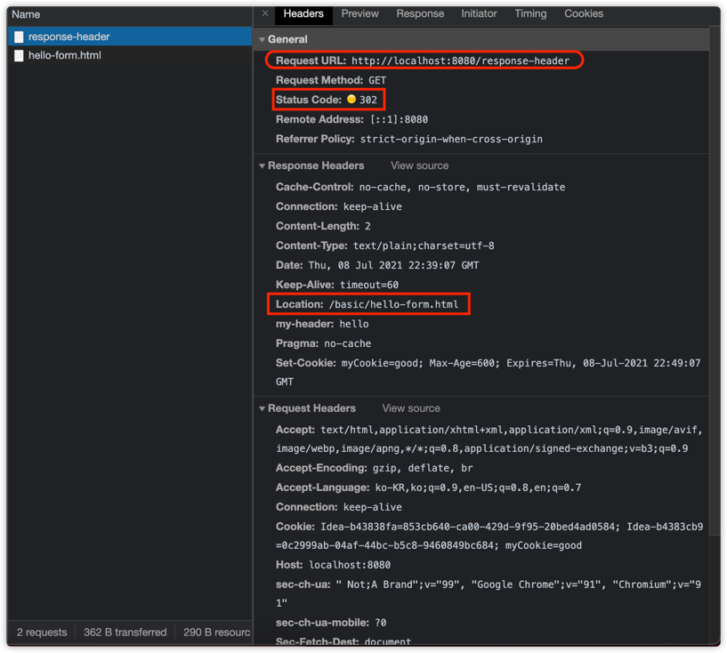

### HttpServletResponse- 기본 사용법

- HTTP 응답 메세지 생성
    - HTTP 응답 코드 지정
    - 헤더 생성
    - 바디 생성
    
- 편의 기능 제공
    - Content-Type
    - 쿠키
    - Redirect
    

```java
@WebServlet(name = "responseHeaderServlet", urlPatterns = "/response-header")
public class ResponseHeaderServlet extends HttpServlet {
    @Override
    protected void service(final HttpServletRequest request, final HttpServletResponse response) throws ServletException, IOException {

        // [status-line]
        response.setStatus(HttpServletResponse.SC_OK); // HTTP 응답 코드 지정

        // [response-headers]
        response.setHeader("Content-Type","text/plain;charset=utf-8");
        response.setHeader("Cache-Control", "no-cache, no-store, must-revalidate"); // 캐시 완전 무효화
        response.setHeader("Pragma", "no-cache"); // 과거 캐시 이력까지 지움 (완전 캐시 무효화를 위해서는 윗 라인과 같이 작성해주면 된다.)
        response.setHeader("my-header","hello");

        response.getWriter().write("안녕하세요.");
    }
}
```


헤더 세팅을 편하게
```java
private void content(final HttpServletResponse response) {
//  response.setHeader("Content-Type","text/plain;charset=utf-8");
    // 이는 위와 동일하다.
    response.setContentType("text/plain");
    response.setCharacterEncoding("utf-8");
//  response.setContentLength(2); // 생략시 자동 생성
}
```

쿠키 설정
```java
private void cookie(HttpServletResponse response){
//  Set-Cookie : myCookie = good; Max-Age=600;
//  response.setHeader("Set-Cookie","myCookie=good; Max-Age=600");

    // 이는 위와 동일하다
    final Cookie cookie = new Cookie("myCookie", "good");
    cookie.setMaxAge(600); // 600 초
    response.addCookie(cookie);
}
```




리다이렉트
```java
private void redirect(final HttpServletResponse response) throws IOException {
  // Status Code 302
  // Location : /basic/hello-form.html

  // response.setStatus(HttpServletResponse.SC_FOUND); //302
  // response.setHeader("Location", "/basic/hello-form.html");

  // 다음 코드는 위의 2줄과 동일하다.
   response.sendRedirect("/basic/hello-form.html");
}
```


- HttpStatus Code는 기본적으로 302로, 그리고 Redirect 할 페이지도 지정을 하면 StatusCoded와 Header에 Location 설정하는 것과 동일하다.
