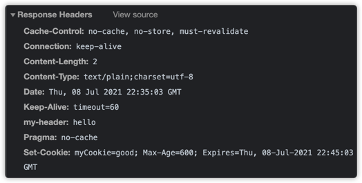
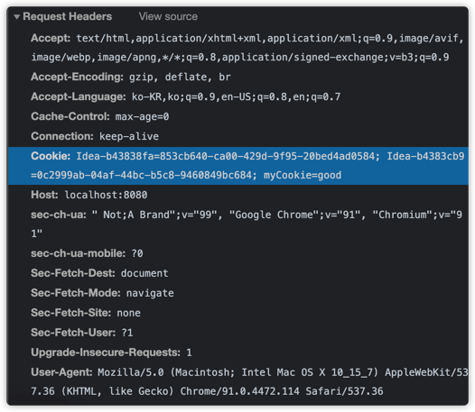
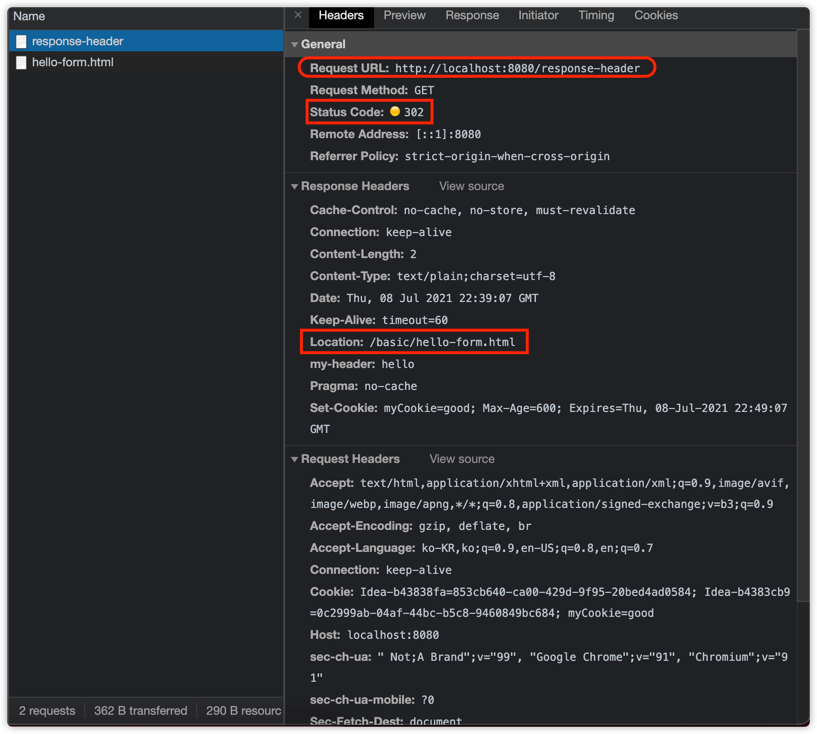
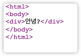
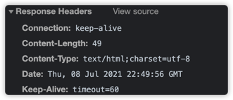
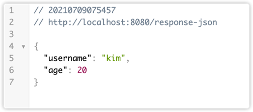

### HttpServletResponse- 기본 사용법

- HTTP 응답 메세지 생성
    - HTTP 응답 코드 지정
    - 헤더 생성
    - 바디 생성

- 편의 기능 제공
    - Content-Type
    - 쿠키
    - Redirect

```java
@WebServlet(name = "responseHeaderServlet", urlPatterns = "/response-header")
public class ResponseHeaderServlet extends HttpServlet {
    @Override
    protected void service(final HttpServletRequest request, final HttpServletResponse response) throws ServletException, IOException {

        // [status-line]
        response.setStatus(HttpServletResponse.SC_OK); // HTTP 응답 코드 지정

        // [response-headers]
        response.setHeader("Content-Type","text/plain;charset=utf-8");
        response.setHeader("Cache-Control", "no-cache, no-store, must-revalidate"); // 캐시 완전 무효화
        response.setHeader("Pragma", "no-cache"); // 과거 캐시 이력까지 지움 (완전 캐시 무효화를 위해서는 윗 라인과 같이 작성해주면 된다.)
        response.setHeader("my-header","hello");

        response.getWriter().write("안녕하세요.");
    }
}
```


헤더 세팅을 편하게

```java
private void content(final HttpServletResponse response) {
//  response.setHeader("Content-Type","text/plain;charset=utf-8");
    // 이는 위와 동일하다.
    response.setContentType("text/plain");
    response.setCharacterEncoding("utf-8");
//  response.setContentLength(2); // 생략시 자동 생성
}
```

쿠키 설정

```java
private void cookie(HttpServletResponse response){
//  Set-Cookie : myCookie = good; Max-Age=600;
//  response.setHeader("Set-Cookie","myCookie=good; Max-Age=600");

    // 이는 위와 동일하다
    final Cookie cookie = new Cookie("myCookie", "good");
    cookie.setMaxAge(600); // 600 초
    response.addCookie(cookie);
}
```




리다이렉트

```java
private void redirect(final HttpServletResponse response) throws IOException {
  // Status Code 302
  // Location : /basic/hello-form.html

  // response.setStatus(HttpServletResponse.SC_FOUND); //302
  // response.setHeader("Location", "/basic/hello-form.html");

  // 다음 코드는 위의 2줄과 동일하다.
   response.sendRedirect("/basic/hello-form.html");
}
```



- HttpStatus Code는 기본적으로 302로, 그리고 Redirect 할 페이지도 지정을 하면 StatusCoded와 Header에 Location 설정하는 것과 동일하다.

---

## HTTP 응답 데이터 - 단순 텍스트, HTML

- 단순 텍스트 응답
    - 앞에서 살펴봄 `writer.println("ok")`
- HTML 응답

```java
@WebServlet(name = "responseHtmlServlet", urlPatterns = "/response-html")
public class ResponseHtmlServlet extends HttpServlet {
    @Override
    protected void service(final HttpServletRequest request, final HttpServletResponse response) throws ServletException, IOException {
        // Content-Type : text/html;charset=utf-8
        response.setContentType("text/html");
        response.setCharacterEncoding("utf-8");

        final PrintWriter writer = response.getWriter();
        writer.println("<html>");
        writer.println("<body>");
        writer.println("<div>안녕?</div>");
        writer.println("</body>");
        writer.println("</html>");
    }
}
```


응답이 text/html이다.


- HTTP 응답으로 HTML을 반환할 때는 content-type을 "text/html"로 지정해야 한다.

---

## HTTP 응답 데이터 - API JSON

```java
@WebServlet(name = "responseJsonServlet", urlPatterns = "/response-json")
public class ResponseJsonServlet extends HttpServlet {

    private ObjectMapper objectMapper = new ObjectMapper();

    @Override
    protected void service(final HttpServletRequest request, final HttpServletResponse response) throws ServletException, IOException {
        //Content-Type : application/json
        response.setContentType("application/json");
        response.setCharacterEncoding("utf-8");

        final HelloData helloData = new HelloData();
        helloData.setUsername("kim");
        helloData.setAge(20);

        // {"username": "kim", "age":20} 으로 변환할 것이다.
        final String result = objectMapper.writeValueAsString(helloData);
        response.getWriter().write(result);
    }
}
```



- HTTP 응답으로 JSON을 반환할 때는 content-type을 `application/json`으로 지정해야한다.
- Jackson 라이브러리가 제공하는 `ObjectMapper.writeValueAsString()`을 사용하면, 객체를 JSON 문자로 변경할 수 있다.

> 참고

- `application/json`은 스펙상 utf-8 형식을 사용하도록 정의되어 있다. 그래서 스펙에서 charset=utf-8과 같은 추가 파라미터를 지원하지 않는다.
- 따라서 `application/json`이라고만 사용해야지 `application/json;charset=utf-8` 이라고 전달하는 것은 의미없는 파라미터를 추가한 것이 된다.
- response.getWriter() 를 사용하면 추가 파라미터를 자동으로 추가해버린다. 이때는 response.getOutputStream()으로 출력하면 그런 문제가 없다.(크게 중요한 것은 아니니 그냥 참고로 지나가자)
