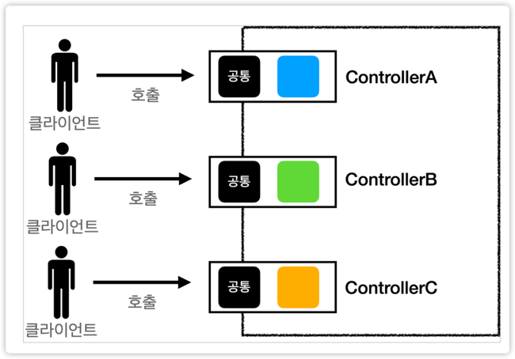
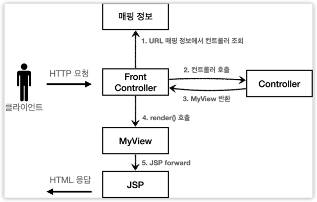
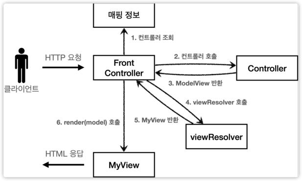

#  MVC 프레임워크 만들기

## Front-Controller Pattern ?

프론트 컨트롤러를 도입하기 전의 상황


- 입구가 없는 것임.
- 그래서 공통 로직을 요청마다 다 만들어야한다는 것임
- View로 이동하는 공통 로직도 다 넣어야 한다는 것


프론트 컨트롤러를 등장 두둥

- 공통 처리 가능
- 프론트 컨트롤러를 제외한 나머지 컨트롤러는 서블릿을 사용하지 않아도 됨!!
    - 요청 매핑을 했을 때 서블릿을 사용했지.
    - 클라이언트에서 요청이 오면 WAS 서버에서 가장 먼저 요청을 받는 것이 FrontController
    - 그래서 나머지 컨트롤러는 이제 서블릿을 사용하지 않아도 됩니다.
    

> 스프링 웹 MVC와 프론트 컨트롤러
- 스프링 웹 MVC의 핵심도 바로 FrontController
- 스프링 웹 MVC의 DispatcherServlet이 FrontController 패턴으로 구현되어 있음!!

---

자, 우선 기존의 구조를 완전히 똑같이 가져가면서 프론트 컨트롤러를 도입해보자.

Controller Interface
````java
public interface ControllerV1 {

    void process(HttpServletRequest request, HttpServletResponse response) throws ServletException, IOException;
}
````

이 인터페이스를 상속받은 각 컨트롤러들

- Form
````java
public class MemberFormControllerV1 implements ControllerV1 {

    @Override
    public void process(final HttpServletRequest request, final HttpServletResponse response) throws ServletException, IOException {
        String viewPath = "/WEB-INF/views/new-form.jsp";
        final RequestDispatcher dispatcher = request.getRequestDispatcher(viewPath);// 컨트롤러에서 뷰로 이동할 때 씀
        dispatcher.forward(request, response); // 이걸 호출하면, 실제로 Controller -> view로 이동하게 됨 (서버 내부에서 서버끼리 호출하는 형태임)
    }
}
````

- Save
```java
public class MemberSaveControllerV1 implements ControllerV1 {
    private MemberRepository memberRepository = MemberRepository.getInstance();

    @Override
    public void process(final HttpServletRequest request, final HttpServletResponse response) throws ServletException, IOException {
        final String username = request.getParameter("username");
        final int age = Integer.parseInt(request.getParameter("age"));

        final Member member = new Member(username, age);
        memberRepository.save(member);
        request.setAttribute("member", member);

        final String viewPath = "/WEB-INF/views/save-result.jsp";
        final RequestDispatcher dispatcher = request.getRequestDispatcher(viewPath);
        dispatcher.forward(request, response);
    }
}
```

- List
```java
public class MemberListControllerV1 implements ControllerV1 {

    private MemberRepository memberRepository = MemberRepository.getInstance();

    @Override
    public void process(final HttpServletRequest request, final HttpServletResponse response) throws ServletException, IOException {
        final List<Member> members = memberRepository.findAll();

        request.setAttribute("members", members);

        final String viewPath = "/WEB-INF/views/members.jsp";
        final RequestDispatcher dispatcher = request.getRequestDispatcher(viewPath);
        dispatcher.forward(request, response);
    }
}
```


- 프론트 컨트롤러
````java
@WebServlet(name = "frontControllerServletV1", urlPatterns = "/front-controller/v1/*") // /front-controller/v1 하위의 어떠한 url이든 다 이 서블릿이 받도록 하겠다.
public class FrontControllerServletV1 extends HttpServlet {

    private Map<String, ControllerV1> controllerMap = new HashMap<>();

    public FrontControllerServletV1() {
        controllerMap.put("/front-controller/v1/members/new-form", new MemberFormControllerV1());
        controllerMap.put("/front-controller/v1/members/save", new MemberSaveControllerV1());
        controllerMap.put("/front-controller/v1/members", new MemberListControllerV1());
    }

    @Override
    protected void service(final HttpServletRequest request, final HttpServletResponse response) throws ServletException, IOException {

        final String requestURI = request.getRequestURI();

        final ControllerV1 controller = controllerMap.get(requestURI);
        if (controller == null) {
            response.setStatus(SC_NOT_FOUND);
            return;
        }

        controller.process(request, response);
    }
}
````

#### 프론트 컨트롤러 분석
> urlPatterns
- urlPatterns = "/front-controller/v1/*" : /front-controller/v1 를 포함한 하위 모든 요청은 이 서블릿에서 받아들인다.
- 예) /front-controller/v1 , /front-controller/v1/a , /front-controller/v1/a/b

> controllerMap
- key: 매핑 URL
- value: 호출될 컨트롤러

> service()
- 먼저 requestURI 를 조회해서 실제 호출할 컨트롤러를 controllerMap 에서 찾는다. 만약 없다면 404(SC_NOT_FOUND) 상태 코드를 반환한다.
- 컨트롤러를 찾고 controller.process(request, response); 을 호출해서 해당 컨트롤러를 실행한다.

> JSP
- JSP는 이전 MVC에서 사용했던 것을 그대로 사용한다.

> 개발 팁
- 어떤 구조 개선을 하게 되는 프로젝트들이 많을 것이다. 
- 구조 개선을 하다보면, `아 이것도 이렇게 바꿀 수 있을 것 같은데?`와 같은 생각이 들기 마련이다.(내가 요새 하고 있는 것이라 너무 공감 중)
- **한 번 참아야 한다!!!!!!!!!!!!!**
- 우선 같은 레벨(구조 개선)에 집중하여 구조를 먼저 개선한 뒤, 바뀐 구조에 대해서 동작에 이상이 없으면 그 이후에 리팩토링 및 개선을 하는 것이 옳다.

--- 

## V2 - 이번에는 뷰를 분리해보자
모든 컨트롤러에서 뷰로 이동하는 부분에 중복이 있고, 깔끔하지 않다.

```java
String viewPath = "/WEB-INF/views/new-form.jsp";
RequestDispatcher dispatcher = request.getRequestDispatcher(viewPath);
dispatcher.forward(request, response);
```
이 부분을 깔끔하게 분리하기 위해 별도로 뷰를 처리하는 객체를 만들자.


```java
public interface ControllerV2 {
    MyView process(HttpServletRequest request, HttpServletResponse response) throws ServletException, IOException;
}
```
```java
public class MemberFormControllerV2 implements ControllerV2 {

    @Override
    public MyView process(final HttpServletRequest request, final HttpServletResponse response) throws ServletException, IOException {
        return new MyView("/WEB-INF/views/new-form.jsp");
    }
}
```

```java
public class MemberListControllerV2 implements ControllerV2 {
    private MemberRepository memberRepository = MemberRepository.getInstance();

    @Override
    public MyView process(final HttpServletRequest request, final HttpServletResponse response) throws ServletException, IOException {
        final List<Member> members = memberRepository.findAll();
        request.setAttribute("members", members);
        return new MyView("/WEB-INF/views/members.jsp");
    }
}
```

```java
public class MemberSaveControllerV2 implements ControllerV2 {
    private MemberRepository memberRepository = MemberRepository.getInstance();

    @Override
    public MyView process(final HttpServletRequest request, final HttpServletResponse response) throws ServletException, IOException {
        final String username = request.getParameter("username");
        final int age = Integer.parseInt(request.getParameter("age"));

        final Member member = new Member(username, age);
        memberRepository.save(member);
        request.setAttribute("member", member);

        return new MyView("/WEB-INF/views/save-result.jsp");
    }
}
```

V2 FrontController
```java@WebServlet(name = "frontControllerServletV2", urlPatterns = "/front-controller/v2/*") // /front-controller/v2 하위의 어떠한 url이든 다 이 서블릿이 받도록 하겠다.
public class FrontControllerServletV2 extends HttpServlet {

    private Map<String, ControllerV2> controllerMap = new HashMap<>();

    public FrontControllerServletV2() {
        controllerMap.put("/front-controller/v2/members/new-form", new MemberFormControllerV2());
        controllerMap.put("/front-controller/v2/members/save", new MemberSaveControllerV2());
        controllerMap.put("/front-controller/v2/members", new MemberListControllerV2());
    }

    @Override
    protected void service(final HttpServletRequest request, final HttpServletResponse response) throws ServletException, IOException {

        final String requestURI = request.getRequestURI();

        final ControllerV2 controller = controllerMap.get(requestURI);
        if (controller == null) {
            response.setStatus(SC_NOT_FOUND);
            return;
        }

        controller.process(request, response).render(request, response);
    }
}
```


---

## Model 추가 - v3 : 이번에는 서블릿 종속성을 제거해보자
- 컨트롤러 입장에서 HttpServletRequest, HttpServletResponse이 꼭 필요할까? 안 쓰는 곳도 있는 걸!?
- 요청 파라미터 정보는 자바의 Map으로 대신 넘기도록 하면 지금 구조에서는 컨트롤러가 서블릿 기술을 몰라도 동작할 수 있다.
- 그리고 request 객체를 Model로 사용하는 대신에 별도의 Model 객체를 만들어서 반환하면 된다.
- 우리가 구현하는 컨트롤러가 서블릿 기술을 전혀 사용하지 않도록 변경해보자!!
- 이렇게 하면 구현 코드도 매우 단순해지고, 테스트 코드 작성이 쉽다.

> 뷰 이름 중복 제거도 해보자
- 컨트롤러에서 지정하는 뷰 이름에 중복이 있는 것을 확인할 수 있다.
- 컨트롤러는 뷰의 논리 이름을 반환하고, 실제 물리 위치의 이름은 프론트 컨트롤러에서 처리하도록 단순화 하자.
- 이렇게 해두면 향후 뷰의 폴더 위치가 함께 이동해도 프론트 컨트롤러만 고치면 된다.
- `/WEB-INF/views/new-form.jsp` -> `new-form`
- `/WEB-INF/views/save-result.jsp` -> `save-result`
- `/WEB-INF/views/members.jsp` -> `members`


### ModelView
- 지금까지 컨트롤러에서 서블릿에 종속적인 `HttpServletRequest`를 사용했다. 
- 그리고 Model도 `request.setAttribute()`를 통해 데이터를 저장하고 뷰에 전달했다.
- 서블릿의 종속성을 제거하기 위해 Model을 직접 만들고, 추가로 View 이름까지 전달하는 객체를 만들어보자.
  (이번 버전에서는 컨트롤러에서 HttpServletRequest를 사용할 수 없다. 따라서 직접 `request.setAttribute()`를 호출할 수 도 없다. 따라서 Model이 별도로 필요하다.)
  

코드를 한 번 살펴보자
```java
public interface ControllerV3 {
    ModelView process(Map<String, String> paramMap); // 서블릿 기술이 하나도 없다!(서블릿에 종속적이지 않다!!)
}
```
요 ModelView가 무엇인고?
```java
public class ModelView { // SpringMVC에는 비슷한 기능의 ModelAndView 라는 것이 있다.
    private String viewName;
    private Map<String, Object> model = new HashMap<>();

    public ModelView(final String viewName) {
        this.viewName = viewName;
    }

    public String getViewName() {
        return viewName;
    }

    public Map<String, Object> getModel() {
        return model;
    }

    public void setViewName(final String viewName) {
        this.viewName = viewName;
    }

    public void setModel(final Map<String, Object> model) {
        this.model = model;
    }
}
```
- 말 그대로, 모델과 뷰를 동시에 저장하는 객체다.

- MemberFormController
````java
public class MemberFormControllerV3 implements ControllerV3 {
    @Override
    public ModelView process(final Map<String, String> paramMap) {
        return new ModelView("new-form"); // WEB-INF/views 와 .jsp를 뺀 논리명만
    }
}
````

- MemberSaveController
```java
public class MemberSaveControllerV3 implements ControllerV3 {

    private MemberRepository memberRepository = MemberRepository.getInstance();

    @Override
    public ModelView process(final Map<String, String> paramMap) {
        final String username = paramMap.get("username");
        final int age = Integer.parseInt(paramMap.get("age"));

        final Member member = new Member(username, age);
        memberRepository.save(member);

        final ModelView mv = new ModelView("save-result");
        mv.getModel().put("member", member);
        return mv;
    }
}
```
- MemberListController
```java
public class MemberListControllerV3 implements ControllerV3 {

    private MemberRepository memberRepository = MemberRepository.getInstance();

    @Override
    public ModelView process(final Map<String, String> paramMap) {
        final List<Member> members = memberRepository.findAll();
        final ModelView mv = new ModelView("members");
        mv.getModel().put("members", members);
        return mv;
    }
}
```

이제 대망의 FrontController는 다음과 같다.
```java
@WebServlet(name = "frontControllerServletV3", urlPatterns = "/front-controller/v3/*") // /front-controller/v3 하위의 어떠한 url이든 다 이 서블릿이 받도록 하겠다.
public class FrontControllerServletV3 extends HttpServlet {

    private Map<String, ControllerV3> controllerMap = new HashMap<>();

    public FrontControllerServletV3() {
        controllerMap.put("/front-controller/v3/members/new-form", new MemberFormControllerV3());
        controllerMap.put("/front-controller/v3/members/save", new MemberSaveControllerV3());
        controllerMap.put("/front-controller/v3/members", new MemberListControllerV3());
    }

    @Override
    protected void service(final HttpServletRequest request, final HttpServletResponse response) throws ServletException, IOException {

        final String requestURI = request.getRequestURI();
        final ControllerV3 controller = controllerMap.get(requestURI);
        if (controller == null) {
            response.setStatus(SC_NOT_FOUND);
            return;
        }

        Map<String, String> paramMap = createParamMap(request); // Request에 있는 파라미터를 다 뽑아오자
        final ModelView mv = controller.process(paramMap); // 논리 이름을 물리 이름으로 바꿔주는 viewResolver가 필요하다

        // mv.getViewName(); // 논리 이름 ex) new-form
        final String viewName = mv.getViewName();
        final MyView view = viewResolver(viewName); // 완성된 실제 물리 View 이름!

        view.render(mv.getModel(), request, response);
    }

    private MyView viewResolver(final String viewName) {
        return new MyView("/WEB-INF/views/" + viewName + ".jsp"); 
    }

    private Map<String, String> createParamMap(final HttpServletRequest request) {
        Map<String, String> paramMap = new HashMap<>();
        request.getParameterNames().asIterator()
               .forEachRemaining(paramName -> paramMap.put(paramName, request.getParameter(paramName)));
        return paramMap;
    }
}
```

- view에서 이제 render를 할 때, request에 model 데이터를 모두 담아서 보내야할 것이다.
- 그래야 jsp에서 ${ }로 값을 받아서 쓸 테니.

그래서 View는 다음과 같이 구현한다.
```java
public class MyView {
    private String viewPath;

    public MyView(final String viewPath) {
        this.viewPath = viewPath;
    }

    public void render(HttpServletRequest request, HttpServletResponse response) throws ServletException, IOException {
        final RequestDispatcher dispatcher = request.getRequestDispatcher(viewPath);
        dispatcher.forward(request, response);
    }

    public void render(final Map<String, Object> model, final HttpServletRequest request, final HttpServletResponse response) throws ServletException, IOException {
        modelToRequestAttribute(model, request); // 모델에 담은 값을 Request에 담아주고
        render(request, response); // 기존에 하던 렌더 방식을 취한다.
    }

    private void modelToRequestAttribute(final Map<String, Object> model, final HttpServletRequest request) {
        model.forEach((key, value) -> request.setAttribute(key, value));
    }
}
```
- 결과적으로 프론트 컨트롤러가 할 일이 많아졌다.
- 그런데 장점은 뭐냐? 실제 호출하는 컨트롤러가 굉장히 심플하다!
- 자자, 다시 한번 구조를 상기하자.

