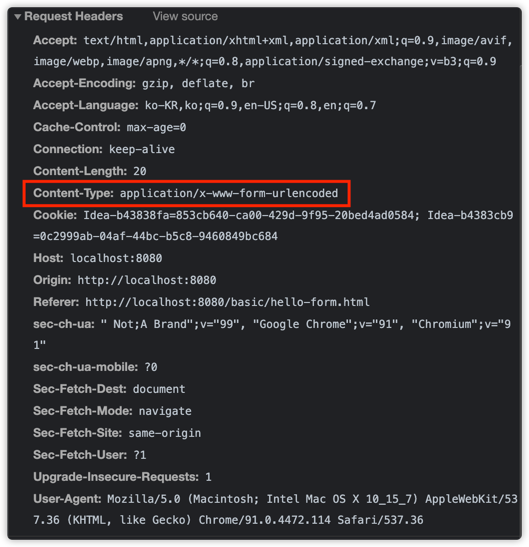
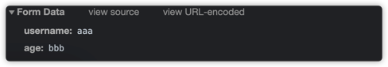
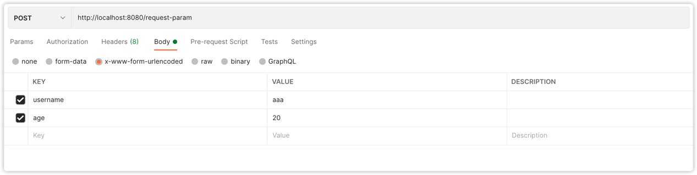

## Http 요청 데이터

1. GET - 쿼리 파라미터
    - /url?username=hello&age=20
    - 메시지 바디 없이, url의 쿼리 파라미터에 데이터를 포함해서 전달
    - 예) 검색, 필터, 페이징 등에서 많이 사용하는 방식
2. POST - HTML Form
    - Content-type : application/x-www-form-urlencoded
    - 메시지 바디에 쿼리 파라미터 형식으로 전달 username=hello&age=20
    - 예) 회원 가입, 상품 주문, HTML Form 사용
    - Form 방식에 POST 만 가능하다(HTTP spec)
        - 스프링은 되는데요? 스프링이 hidden field에 넣어두고, 다른(POST가 아닌) 핸들러에 매핑해주는 것처럼 보이는 것 뿐임.
3. HTTP message body에 데이터를 직접 담아서 요청
    - HTTP API에서 주로 사용, JSON, XML, TEXT
    - 데이터 형식은 주로 JSON 사용
    - POST, PUT, PATCH
    
---

### GET 쿼리 파라미터
- 전달 데이터
    - username = hello
    - age = 20
   
메시지 바디 없이, URL의 쿼리 파라미터를 사용해서 데이터를 전달하자.
쿼리 파라미터는 URL에 다음과 같이 `?`를 시작으로 보낼 수 있다. 추가 파라미터는 `&`로 구분하면 된다.
- `http://localhost:8080/request-param?username=hello&age=20`


#### 코드
````java
/**
 * 1. 파라미터 전송 기능
 * http://localhost:8080/request-param?username=hello&age=20
 */
@WebServlet(name = "requestParamServlet", urlPatterns = "/request-param")
public class RequestParamServlet extends HttpServlet {
    @Override
    protected void service(final HttpServletRequest request, final HttpServletResponse response) throws ServletException, IOException {

        // http://localhost:8080/request-param?username=dolphago&age=20
        System.out.println("[전체 파라미터 조회] - start");

        // username=dolphago
        // age=20
        request.getParameterNames().asIterator()
               .forEachRemaining(paramName -> System.out.println(paramName + "=" + request.getParameter(paramName)));

        System.out.println("[전체 파라미터 조회] - end");

        System.out.println("[단일 파라미터 조회] - start");

        final String username = request.getParameter("username");
        final String age = request.getParameter("age");

        System.out.println("username = " + username);
        System.out.println("age = " + age);

        System.out.println("[단일 파라미터 조회] - end");

        // 만약 다음과 같이 같은 파라미터에 2개 이상의 데이터가 들어온다면? 가장 먼저 매칭된 dolphago먼저 출력된다.
        // http://localhost:8080/request-param?username=dolphago&age=20&username=dolphago2
        // 결과
        // [전체 파라미터 조회] - start
        // username=dolphago
        // age=20
        // [전체 파라미터 조회] - end
        // [단일 파라미터 조회] - start
        // username = dolphago
        // age = 20
        // [단일 파라미터 조회] - end

        // 하지만 이런 것들도 중복된 것을 찾아볼 수 있는 방법도 있다.
        System.out.println("[이름이 같은 복수 파라미터 조회]");
        final String[] usernames = request.getParameterValues("username");
        for (String name : usernames) {
            System.out.println("name = " + name);
        }
        // 결과
        // [이름이 같은 복수 파라미터 조회]
        // name = dolphago
        // name = dolphago2

        response.getWriter().write("ok");
    }
}
````


 만약 다음과 같이 같은 파라미터에 2개 이상의 데이터가 들어온다면? 가장 먼저 매칭된 dolphago먼저 출력된다.
`http://localhost:8080/request-param?username=dolphago&age=20&username=dolphago2`
결과
```java
 [전체 파라미터 조회] - start
 username=dolphago
 age=20
 [전체 파라미터 조회] - end
 [단일 파라미터 조회] - start
 username = dolphago
 age = 20
 [단일 파라미터 조회] - end
```
하지만 이런 것들도 중복된 것을 찾아볼 수 있는 방법도 있다.

```java
System.out.println("[이름이 같은 복수 파라미터 조회]");
final String[] usernames = request.getParameterValues("username");
for (String name : usernames) {
   System.out.println("name = " + name);
}
// 결과
// [이름이 같은 복수 파라미터 조회]
// name = dolphago
// name = dolphago2
```

---

HTTP 요청 데이터 - POST HTML Form
- 주로 회원가입, 상품 주문 등에서 사용
- 특징
   - content-type : application/x-www-form-urlencoded
   - 메시지 바디에 쿼리 파라미터 형식으로 데이터를 전달한다 : username=dolphago&age=20
   

```html
<!DOCTYPE html>
<html>
<head>
  <meta charset="UTF-8">
  <title>Title</title>
</head>
<body>
<form action="/request-param" method="post">
  username: <input type="text" name="username" /> age: <input type="text" name="age" />
  <button type="submit">전송</button>
</form>
</body>
</html>
```




- `application/x-www-form-urlencoded`형식은 앞서 GET에서 살펴본 쿼리 파라미터 형식과 같다.
- 따라서 쿼리 파라미터 조회 메서드를 그대로 사용하면 된다.
- 클라이언트(웹 브라우저) 입장에서는 두 방식에 차이가 있지만, 서버 입장에서는 둘의 형식이 동일하므로, `request.getParameter()`로 편리하게 구분없이 조회가 가능하다.

> 정리하면, `request.getParamter()`는 GET URL 쿼리 파라미터 형식도 지원하고, POST HTML Form 형식도 둘 다 지원한다.


- 참고
    - content-type은 HTTP 메시지 바디의 데이터 형식을 지원한다.
    - GET URL 쿼리 파라미터 형식으로 클라이언트에서 서버로 데이터를 전달할 때는 HTTP 메시지 바디를 사용하지 않기 때문에 content-type이 없다.
    - POST HTML Form 형식으로 데이터를 전달하면, HTTP 메시지 바디에 해당 데이터를 포함해서 보내기 때문에 바디에 포함된 데이터가 어떤 형식인지 content-type을 꼭 지정해야 한다.
    - 이렇게 폼으로 데이터를 전송하는 형식을 `application/x-www-form-urlencoded`라고 한다.
    


---

## HTTP 요청 데이터 - API 메시지 바디 - 단순 텍스트

HTTP Message body에 데이터를 직접 담아서 요청
- HTTP API에서 주로 사용, JSON, XML, TEXT
- 데이터 형식은 주로 JSON을 사용
- POST, PUT, PATCH

```java
@WebServlet(name = "requestBodyStringServlet", urlPatterns = "/request-body-string")
public class RequestBodyStringServlet extends HttpServlet {

    @Override
    protected void service(final HttpServletRequest request, final HttpServletResponse response) throws ServletException, IOException {
        final ServletInputStream inputStream = request.getInputStream(); // 메세지 바디의 내용을 바로 Byte code로 얻어올 수 있다. 이를 String으로 바꿔주자.
        final String messageBody = StreamUtils.copyToString(inputStream, StandardCharsets.UTF_8);

        System.out.println("messageBody = " + messageBody);

        response.getWriter().write("ok");
    }
}
```

```text
 Received [POST /request-body-string HTTP/1.1
Content-Type: text/plain
User-Agent: PostmanRuntime/7.28.1
Accept: */*
Postman-Token: 9e4c6d1d-51df-4bb7-8d39-ccffff410710
Host: localhost:8080
Accept-Encoding: gzip, deflate, br
Connection: keep-alive
Content-Length: 6

hello!]
messageBody = hello!
```


### HTTP 요청 데이터 - API 메시지 바디 - JSON

- content-type : `application/json`
- message body : `{ "username" : "hello", "age" : 20}`
- 결과 : messageBody = `{"username": "hello", "age" : 20}`

JSON은 주로 객체로 받아서 쓴다.
따라서 파싱할 수 있도록 객체를 하나 생성하자


#### JSON 형식 파싱 객체 추가
```java
@Getter
@Setter
public class HelloData {
    private String username;
    private int age;
}
```

```java
@WebServlet(name = "requestBodyJsonServlet", urlPatterns = "/request-body-json")
public class RequestBodyJsonServlet extends HttpServlet {
    @Override
    protected void service(final HttpServletRequest request, final HttpServletResponse response) throws ServletException, IOException {
        final ServletInputStream inputStream = request.getInputStream();
        final String messageBody = StreamUtils.copyToString(inputStream, StandardCharsets.UTF_8);
        System.out.println("messageBody = " + messageBody);
    }
}
```

- `http://localhost:8080/request-body-json`
- body = `
{
"username" : "hello",
"age": 20
}
`
- content-type : application/json
- 결과
```text
messageBody = {
    "username" : "hello",
    "age": 20
}
```

- 이제 이 값을 HelloData로 변환시켜볼 것이다.
- 스프링은 기본 라이브러리로 jackson을 사용한다.

```java
@WebServlet(name = "requestBodyJsonServlet", urlPatterns = "/request-body-json")
public class RequestBodyJsonServlet extends HttpServlet {

    private ObjectMapper objectMapper = new ObjectMapper();

    @Override
    protected void service(final HttpServletRequest request, final HttpServletResponse response) throws ServletException, IOException {
        final ServletInputStream inputStream = request.getInputStream();
        final String messageBody = StreamUtils.copyToString(inputStream, StandardCharsets.UTF_8);
        System.out.println("messageBody = " + messageBody);

        final HelloData helloData = objectMapper.readValue(messageBody, HelloData.class);

        System.out.println("helloData.getUsername() = " + helloData.getUsername());
        System.out.println("helloData.getAge() = " + helloData.getAge());

        response.getWriter().write("ok");
    }
}
```
출력 결과는 다음과 같다.
```text
messageBody = {
    "username" : "hello",
    "age": 20
}
helloData.getUsername() = hello
helloData.getAge() = 20
```


참고로 나중에 스프링 MVC를 극한으로 사용하면 다음과 같이 가능하다.

```java
@WebServlet(name = "requestBodyJsonServlet", urlPatterns = "/request-body-json")
public class RequestBodyJsonServlet extends HttpServlet {
    @Override
    protected void service(HelloData helloData) throws ServletException, IOException {
        System.out.println("helloData.getUsername() = " + helloData.getUsername());
        System.out.println("helloData.getAge() = " + helloData.getAge());
        response.getWriter().write("ok");
    }
}
```


> 참고
- JSON 결과를 파싱해서 사용할 수 있는 자바 객체로 변환하려면 Jackson, Gson 같은 JSON 변환 라이브러리를 추가해서 사용해야 한다.
- 스프링 부트로 Spring MVC를 선택하면, 기본적으로 Jackson 라이브러리(`ObjectMapper`)를 함께 제공한다.
- HTML form 데이터도 메시지 바디를 통해 전송되므로 직접 읽을 수 있다. 
- 하지만 편리한 파라미터 조회 기능인 `request.getParameter(...)`를 이미 제공하기 때문에 파라미터 조회 기능을 사용하면 된다.
- 즉 x-www-urlencoded로 보내도, `messageBody = username=aaa&age=20` 이렇게 출력이 된다. 이건 쿼리 파라미터 조회를 하면 된다는 소리임
