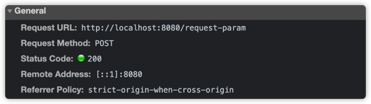

## Http 요청 데이터

1. GET - 쿼리 파라미터
    - /url?username=hello&age=20
    - 메시지 바디 없이, url의 쿼리 파라미터에 데이터를 포함해서 전달
    - 예) 검색, 필터, 페이징 등에서 많이 사용하는 방식
2. POST - HTML Form
    - Content-type : application/x-www-form-urlencoded
    - 메시지 바디에 쿼리 파라미터 형식으로 전달 username=hello&age=20
    - 예) 회원 가입, 상품 주문, HTML Form 사용
3. HTTP message body에 데이터를 직접 담아서 요청
    - HTTP API에서 주로 사용, JSON, XML, TEXT
    - 데이터 형식은 주로 JSON 사용
    - POST, PUT, PATCH
    
---

### GET 쿼리 파라미터
- 전달 데이터
    - username = hello
    - age = 20
   
메시지 바디 없이, URL의 쿼리 파라미터를 사용해서 데이터를 전달하자.
쿼리 파라미터는 URL에 다음과 같이 `?`를 시작으로 보낼 수 있다. 추가 파라미터는 `&`로 구분하면 된다.
- `http://localhost:8080/request-param?username=hello&age=20`


#### 코드
````java
/**
 * 1. 파라미터 전송 기능
 * http://localhost:8080/request-param?username=hello&age=20
 */
@WebServlet(name = "requestParamServlet", urlPatterns = "/request-param")
public class RequestParamServlet extends HttpServlet {
    @Override
    protected void service(final HttpServletRequest request, final HttpServletResponse response) throws ServletException, IOException {

        // http://localhost:8080/request-param?username=dolphago&age=20
        System.out.println("[전체 파라미터 조회] - start");

        // username=dolphago
        // age=20
        request.getParameterNames().asIterator()
               .forEachRemaining(paramName -> System.out.println(paramName + "=" + request.getParameter(paramName)));

        System.out.println("[전체 파라미터 조회] - end");

        System.out.println("[단일 파라미터 조회] - start");

        final String username = request.getParameter("username");
        final String age = request.getParameter("age");

        System.out.println("username = " + username);
        System.out.println("age = " + age);

        System.out.println("[단일 파라미터 조회] - end");

        // 만약 다음과 같이 같은 파라미터에 2개 이상의 데이터가 들어온다면? 가장 먼저 매칭된 dolphago먼저 출력된다.
        // http://localhost:8080/request-param?username=dolphago&age=20&username=dolphago2
        // 결과
        // [전체 파라미터 조회] - start
        // username=dolphago
        // age=20
        // [전체 파라미터 조회] - end
        // [단일 파라미터 조회] - start
        // username = dolphago
        // age = 20
        // [단일 파라미터 조회] - end

        // 하지만 이런 것들도 중복된 것을 찾아볼 수 있는 방법도 있다.
        System.out.println("[이름이 같은 복수 파라미터 조회]");
        final String[] usernames = request.getParameterValues("username");
        for (String name : usernames) {
            System.out.println("name = " + name);
        }
        // 결과
        // [이름이 같은 복수 파라미터 조회]
        // name = dolphago
        // name = dolphago2

        response.getWriter().write("ok");
    }
}
````


 만약 다음과 같이 같은 파라미터에 2개 이상의 데이터가 들어온다면? 가장 먼저 매칭된 dolphago먼저 출력된다.
`http://localhost:8080/request-param?username=dolphago&age=20&username=dolphago2`
결과
```java
 [전체 파라미터 조회] - start
 username=dolphago
 age=20
 [전체 파라미터 조회] - end
 [단일 파라미터 조회] - start
 username = dolphago
 age = 20
 [단일 파라미터 조회] - end
```
하지만 이런 것들도 중복된 것을 찾아볼 수 있는 방법도 있다.

```java
System.out.println("[이름이 같은 복수 파라미터 조회]");
final String[] usernames = request.getParameterValues("username");
for (String name : usernames) {
   System.out.println("name = " + name);
}
// 결과
// [이름이 같은 복수 파라미터 조회]
// name = dolphago
// name = dolphago2
```

---

HTTP 요청 데이터 - POST HTML Form
- 주로 회원가입, 상품 주문 등에서 사용
- 특징
   - content-type : application/x-www-form-urlencoded
   - 메시지 바디에 쿼리 파라미터 형식으로 데이터를 전달한다 : username=dolphago&age=20
   

```html
<!DOCTYPE html>
<html>
<head>
  <meta charset="UTF-8">
  <title>Title</title>
</head>
<body>
<form action="/request-param" method="post">
  username: <input type="text" name="username" /> age: <input type="text" name="age" />
  <button type="submit">전송</button>
</form>
</body>
</html>
```



- `application/x-www-form-urlencoded`형식은 앞서 GET에서 살펴본 쿼리 파라미터 형식과 같다.
- 따라서 쿼리 파라미터 조회 메서드를 그대로 사용하면 된다.
- 클라이언트(웹 브라우저) 입장에서는 두 방식에 차이가 있지만, 서버 입장에서는 둘의 형식이 동일하므로, `request.getParameter()`로 편리하게 구분없이 조회가 가능하다.

> 정리하면, `request.getParamter()`는 GET URL 쿼리 파라미터 형식도 지원하고, POST HTML Form 형식도 둘 다 지원한다.


- 참고
    - content-type은 HTTP 메시지 바디의 데이터 형식을 지원한다.
    - GET URL 쿼리 파라미터 형식으로 클라이언트에서 서버로 데이터를 전달할 때는 HTTP 메시지 바디를 사용하지 않기 때문에 content-type이 없다.
    - POST HTML Form 형식으로 데이터를 전달하면, HTTP 메시지 바디에 해당 데이터를 포함해서 보내기 때문에 바디에 포함된 데이터가 어떤 형식인지 content-type을 꼭 지정해야 한다.
    - 이렇게 폼으로 데이터를 전송하는 형식을 `application/x-www-form-urlencoded`라고 한다.
    

