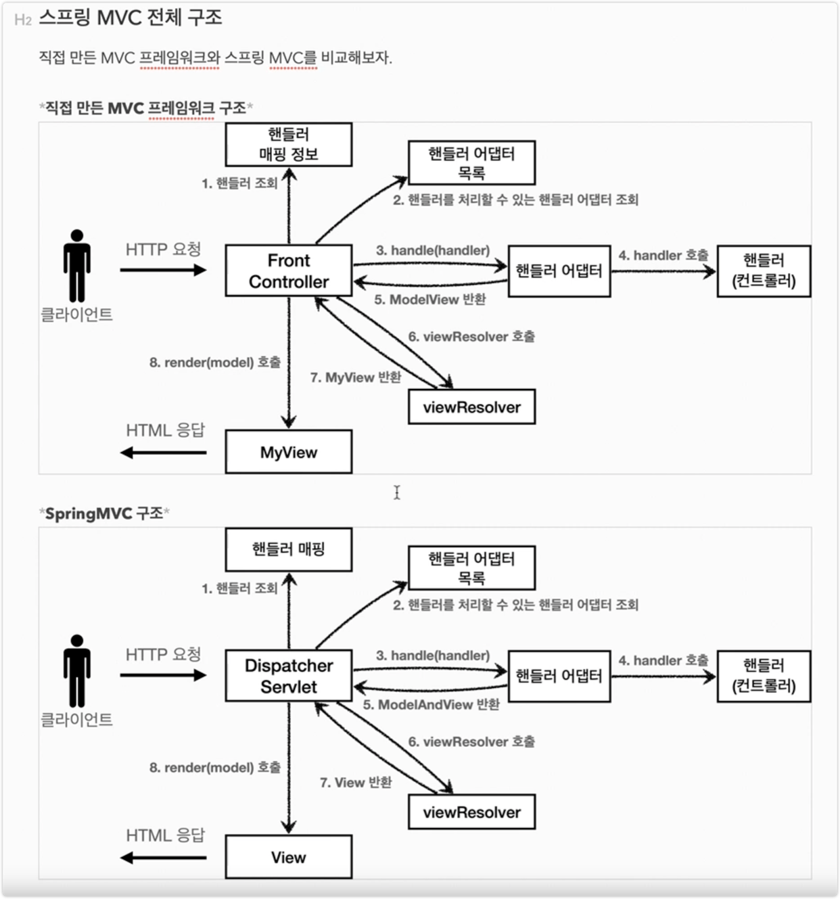
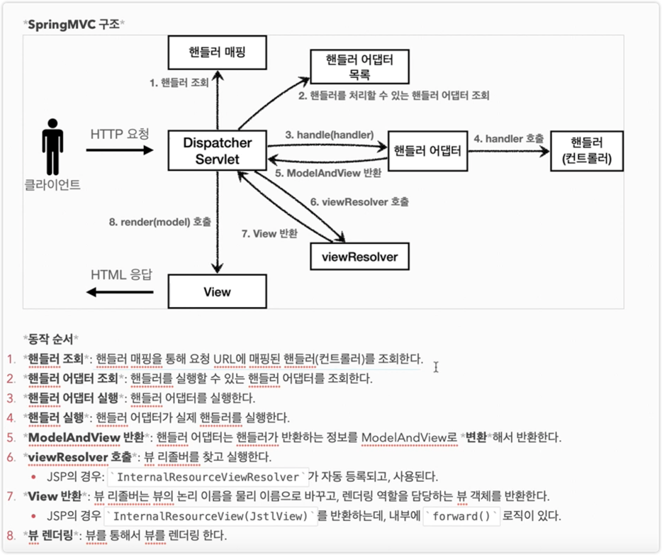

## Spring MVC 전체 구조



- FrontController -> DispatcherServlet
- handlerMappingMap -> HandlerMapping
- MyHandlerAdapter -> HandlerAdapter
- ModelView -> ModelAndView
- viewResolver -> ViewResolver(인터페이스 - 확장성 있게)
- MyView -> View (인터페이스 - 확장성 있게)

### DispatcherServlet 구조를 살펴보자

`org.springframework.web.servlet.DispatcherSevlet`

- 이게 스프링 MVC의 핵심이다. (스프링 MVC의 프론트 컨트롤러)

#### DispatcherServlet 서블릿 등록

- DispatcherSerlvet도 부모 클래스에서 HttpServlet을 상속 받아서 사용하고, 서블릿으로 동작한다.
    - DispatcherServlet -> FrameworkServlet -> HttpServletBean -> HttpServlet

- SpringBoot는 `DispatcherServlet`을 서블릿으로 자동으로 등록하면서, 모든 경로(urlPatterns = "/")에 대해서 매핑한다.
    - 참고로, 더 자세한 경로가 우선순위가 높다. 그래서 기존에 등록한 서블릿도 함께 동작한다.

> 요청 흐름

1. 서블릿이 호출되면, HttpServlet이 제공하는 service()가 제공된다.
2. 스프링 MVC는 DispatcherServlet의 부모인 FrameworkServlet에서 service()를 오버라이드 해두었다.
3. FrameworkServlet.serivce()를 시작으로 여러 메서드가 호출되면서, DispatcherServlet.doDispatch()가 호출이 된다.

- DispatcherServlet에서 `doDispatch`가 가장 핵심이다.

- 지금부터 `doDispatch()` 코드를 분석해본다.
- 예외처리, 인터셉터 기능은 설명에서 제외한다.

```java
protected void doDispatch(HttpServletRequest request,HttpServletResponse response)throws Exception{
    HttpServletRequest processedRequest=request;
    HandlerExecutionChain mappedHandler=null;
    ModelAndView mv=null;
    // 1. 핸들러 조회
    mappedHandler=getHandler(processedRequest);
    if(mappedHandler==null){
      noHandlerFound(processedRequest,response);
      return;
    }
    // 2. 핸들러 어댑터 조회 - 핸들러를 처리할 수 있는 어댑터
    HandlerAdapter ha=getHandlerAdapter(mappedHandler.getHandler());
    // 3. 핸들러 어댑터 실행 -> 4. 핸들러 어댑터를 통해 핸들러 실행 -> 5. ModelAndView 반환
    mv=ha.handle(processedRequest,response,mappedHandler.getHandler());
    processDispatchResult(processedRequest,response,mappedHandler,mv,dispatchException);
}

private void processDispatchResult(HttpServletRequest request,HttpServletResponse response,HandlerExecutionChain mappedHandler,ModelAndView mv,Exception exception) throws Exception{
    // 뷰 렌더링 호출
    render(mv,request,response);
}

protected void render(ModelAndView mv,HttpServletRequest request,HttpServletResponse response)throws Exception{
    View view;
    String viewName=mv.getViewName();
    // 6. 뷰 리졸버를 통해서 뷰 찾기, 7. View 반환
    view=resolveViewName(viewName,mv.getModelInternal(),locale,request);
    // 8. 뷰 렌더링
    view.render(mv.getModelInternal(),request,response);
}
```

### SpringMVC 구조



### 인터페이스

- 스프링 MVC의 가장 큰 강점은 DispatcherServlet 코드의 변경 없이, 원하는 기능을 변경하거나 확장할 수 있다는 점.
- 이 인터페이스들만 구현해서 DispatcherServlet에 등록하면 우리만의 컨트롤러를 만들어볼 수 있다.

> 주요 인터페이스 목록

- 핸들러 매핑: `org.springframework.web.servlet.HandlerMapping`
- 핸들러 어댑터: `org.springframework.web.servlet.HandlerAdapter`
- 뷰 리졸버: `org.springframework.web.servlet.ViewResolver`
- 뷰: `org.springframework.web.servlet.View`
