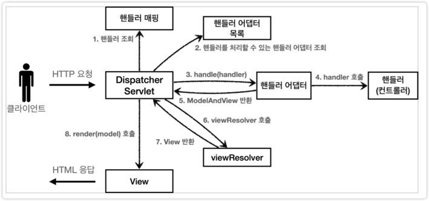

# View Resolver

- 스프링 부트가 자동 등록하는 뷰 리졸버(실제로는 더 많지만, 중요한 부분 위주로 설명하기 위해 일부 생략)

- 1 = BeanNameViewResolver : 빈 이름으로 뷰를 찾아서 반환한다. (예: 엑셀 파일 생성 기능에 사용)
- 2 = InternalResourceViewResolver : JSP를 처리할 수 있는 뷰를 반환한다.

1. 핸들러 어댑터 호출 핸들러 어댑터를 통해 new-form 이라는 논리 뷰 이름을 획득한다.

2. ViewResolver 호출

- new-form 이라는 뷰 이름으로 viewResolver를 순서대로 호출한다.
- BeanNameViewResolver 는 new-form 이라는 이름의 스프링 빈으로 등록된 뷰를 찾아야 하는데 없다. InternalResourceViewResolver 가 호출된다.

3. InternalResourceViewResolver

- 이 뷰 리졸버는 InternalResourceView 를 반환한다.

4. 뷰 - InternalResourceView

- InternalResourceView 는 JSP처럼 포워드 forward() 를 호출해서 처리할 수 있는 경우에 사용한다.

5.view.render()

- view.render() 가 호출되고 InternalResourceView 는 forward() 를 사용해서 JSP를 실행한다.

> 참고

- InternalResourceViewResolver 는 만약 JSTL 라이브러리가 있으면 InternalResourceView 를 상속받은 JstlView 를 반환한다.
- JstlView 는 JSTL 태그 사용시 약간의 부가 기능이 추가된다.

> 참고

- 다른 뷰는 실제 뷰를 렌더링하지만, JSP의 경우 forward() 통해서 해당 JSP로 이동(실행)해야 렌더링이 된다.
- JSP를 제외한 나머지 뷰 템플릿들은 forward() 과정 없이 바로 렌더링 된다.

> 참고

- Thymeleaf 뷰 템플릿을 사용하면 ThymeleafViewResolver 를 등록해야 한다.
- 최근에는 라이브러리만 추가하면 스프링 부트가 이런 작업도 모두 자동화해준다.
